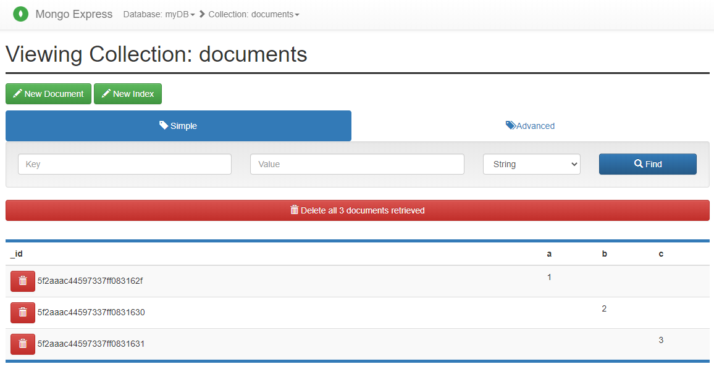

# nuxt-app

Nuxt.js アプリ開発練習

## Environment

- OS:
    - Ubuntu 20.04
- Docker: 19.03.12
    - docker-compose: 1.26.0

### Setup
```bash
# add execution permission to ./n
$ chmod +x ./n

# setup and start docker containers
## node command: service://node
## mongodb server: service://db => http://localhost:<random_port>
## mongodb express server: service://admin => http://localhost:32776
$ docker-compose build
$ docker-compose up -d

# create nuxt project => ./app/
## $ docker-compose run node npx create-nuxt-app app
$ ./n npx create-nuxt-app app
## Project name: app
## Programming language: JavaScript
## Package manager: Npm
## UI framework: Buefy
## Nuxt.js modules: Axios
## Linting tools: ESLint
## Testing framework: None
## Rendering mode: Universal (SSR / SSG)
## Deployment target: Server (Node.js hosting)
## Development tools: jsconfig.json

# remove app .git
$ rm -rf app/.git

# start nodejs server
## $ docker-compose run --service-ports node npm run --prefix ./app/ dev
$ ./n npm run --prefix ./app/ dev

# => Listening on: http://localhost:32775 => service://node:3000
```


***

## Tests

### MongoDB from Node.js
```bash
# install node module: mongodb => service://node:/node_modules/
## $ docker-compose run node npm i --prefix / mongodb
$ ./n npm i --prefix / mongodb

# $ docker-compose run node node tests/mongodb.js
$ ./n node tests/mongodb.js

connected
Inserted 3 documents into the collection
{
  result: { ok: 1, n: 3 },
  ops: [
    { a: 1, _id: 5f2add9fd472a97a35c46942 },
    { b: 2, _id: 5f2add9fd472a95424c46943 },
    { c: 3, _id: 5f2add9fd472a97e8ec46944 }
  ],
  insertedCount: 3,
  insertedIds: {
    '0': 5f2add9fd472a97a35c46942,
    '1': 5f2add9fd472a95424c46943,
    '2': 5f2add9fd472a97e8ec46944
  }
}
```

http://localhost:32776/db/myDB/documents


